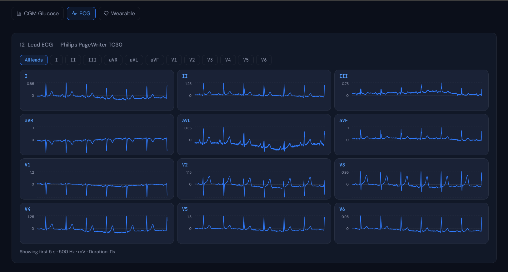

# AI-READI Clinical Analytics Dashboard

A clinical analytics dashboard for exploring the **Type 2 Diabetes from the AI-READI Project Version 3.0.0** [[1]](#1), [[2]](#2) flagship Type 2 Diabetes dataset built for hospital demonstrations and research insights.


---

## Overview

Navigating the 3.82 TB AI-READI dataset can be daunting. This dashboard bridges the gap between raw data and clinical insights, enabling researchers to:
* **Explore Cohorts:** Filter 2,280 participant cohorts across 4 diabetic severity groups and 3 clinical sites.
* **Visualize Multi-modal Data:** Seamlessly view 12-lead ECG waveforms, continuous glucose monitoring (CGM) traces, and Garmin wearable vitals on a per-patient basis.
* **Track Distributions:** Monitor enrollment trends, recommended ML splits (Train/Val/Test), and modality coverage overlaps.
---

## 📸 Dashboard Gallery

### Patient Explorer
Filter and browse the participant database across clinical sites, ML splits, and study groups.


### Individual Participant Profile
View a comprehensive breakdown of a single patient, complete with on-demand AI clinical summaries.


### Continuous Glucose Monitoring (CGM)
Analyze Time-in-Range (TIR) metrics and interactive glucose traces.


### 12-Lead ECG Visualization
Examine high-resolution cardiac waveforms directly in the browser.


### Modality Coverage
Track dataset completeness across all 9 data modalities and view the recommended Machine Learning dataset splits.


### Enrollment Timeline & Demographics
Monitor the study's collection progress over time and age distributions.


---

## Project Structure

```
aireadi-dashboard/
├── backend/               # FastAPI Python backend
│   ├── main.py            # API entry point
│   ├── routers/           # Route handlers (cohort, patient, ecg, cgm)
│   ├── services/          # Data loading services (WFDB, OMOP, Dexcom)
│   ├── models.py          # Pydantic response models
│   └── requirements.txt
├── frontend/              # React + Vite frontend
│   ├── src/
│   │   ├── components/    # Reusable UI components
│   │   ├── pages/         # Dashboard, Patient, Explorer pages
│   │   ├── hooks/         # Data fetching hooks
│   │   └── utils/         # Clinical helpers (TIR, glucose zones)
│   ├── package.json
│   └── vite.config.js
├── scripts/
│   ├── preprocess.py      # One-time data indexing script
│   └── verify_dataset.py  # Sanity check dataset paths
├── data/
│   └── participants_index.json  # Pre-built participant index
├── .env.example
├── docker-compose.yml
└── README.md
```
---

## 🛠 Tech Stack

* **Frontend:** React 18, Vite, Recharts, Tailwind CSS
* **Backend:** FastAPI, Pandas, Pydantic
* **Data Processing:** WFDB (ECG), OMOP CSV (Clinical), Open mHealth JSON (CGM/Wearables)
* **Deployment:** Docker Compose ready

---

## Quick Start

### Prerequisites
- Python 3.10+
- Node.js 18+
- You must have approved access to the AI-READI dataset and have it downloaded (or accessible via a VM).

### 1. Clone and configure

```bash
git clone https://github.com/mdbasit897/aireadi-dashboard.git
cd aireadi-dashboard
cp .env.example .env
# Edit .env — set DATASET_ROOT to your dataset path

*Open `.env` and set `DATASET_ROOT` to the absolute path of your AI-READI dataset.*
```

### 2. Run the indexing script (one-time)

```bash
cd scripts
pip install -r ../backend/requirements.txt
python preprocess.py
```

This scans the dataset directory and builds a fast lookup index at `data/participants_index.json`.

### 3. Start the backend

```bash
cd backend
pip install -r requirements.txt
uvicorn main:app --host 0.0.0.0 --port 8000 --reload --env-file ../.env
```

### 4. Start the frontend

```bash
cd frontend
npm install
npm run dev
```

The dashboard will be at **http://localhost:5173**


### Optional: Run with Docker

If you prefer a containerized setup, ensure your `DATASET_ROOT` is set in the `.env` file and run:

```bash
docker-compose up --build
```

## Key Endpoints

| Endpoint | Description |
|---|---|
| `GET /api/cohort/summary` | Aggregate cohort stats |
| `GET /api/cohort/enrollment` | Monthly enrollment timeline |
| `GET /api/patients` | Paginated participant list with filters |
| `GET /api/patients/{id}` | Single participant profile |
| `GET /api/patients/{id}/cgm` | CGM glucose trace |
| `GET /api/patients/{id}/ecg` | 12-lead ECG waveform data |
| `GET /api/patients/{id}/wearable` | Garmin wearable summary |
| `GET /api/patients/{id}/summary` | AI-generated clinical summary |

---

## Demo Notes

- **Read-only**: The dashboard only reads data, never modifies it
- **Offline capable**: All data is local or on your Cloud Storage Services; no external API calls.
- **License**: This dashboard is open-sourced under the [MIT License](LICENSE).
*Note: The AI-READI dataset itself is governed by a custom [license](https://doi.org/10.5281/zenodo.17555036), complete information is available on https://fairhub.io/datasets/3 *

---

## Tech Stack

| Layer | Technology |
|---|---|
| Frontend | React 18, Vite, Recharts, Tailwind CSS |
| Backend | FastAPI, WFDB, Pandas, Pydantic |
| Data formats | WFDB (ECG), OMOP CSV (clinical), Open mHealth JSON (CGM) |
| Deployment | Docker Compose on Azure VM |

## References
<a id="1">[1]</a> 
AI-READI Consortium. (2024). "AI-READI: rethinking data collection, preparation and
sharing for propelling AI-based discoveries in diabetes research and beyond."
Nature metabolism. https://doi.org/10.1038/s42255-024-01165-x

<a id="2">[2]</a> 
AI-READI Consortium. (2025). Flagship Dataset of Type 2 Diabetes from the
AI-READI Project (3.0.0) [Data set]. FAIRhub. https://doi.org/10.60775/fairhub.3